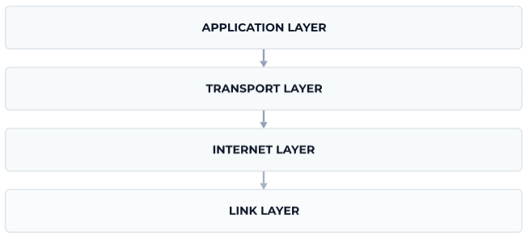

# Network Protocols
> Network protocols are sets of rules or standards used by devices to communicate with each other over a network.

Some examples of network protocols are:

- HTTP, used for web browsing
- SMTP, used for email
- FTP, used for file transfers

Network protocols can be broadly categorized into "layers". Each layer relies on the layer below it and provides services to the layer above it.

One model that categorizes network protocols into layers is the TCP/IP model. It has 4 layers:

### Link Layer
> Bottom Layer

It is responsible for sending data over a **physical medium** , such as a cable or a wireless connection.

Some examples of Link Layer protocols are:

- Ethernet
- Wi-Fi
- Bluetooth

### Internet Layer

The Internet Layer is the next layer. It is responsible for routing data across different networks to get it to the right destination.

The Internet Layer relies on services provided by the Link Layer.

The fundamental protocol in this layer is the **Internet Protocol (IP)**. But there are others too:

- ICMP, used by programs like `ping` to test connectivity
- ARP, used to map IP addresses to MAC addresses

### Transport Layer
This layer's job is to provide reliable data transfer between two devices.

The Transport Layer relies on services provided by the Internet Layer.

The most commonly used Transport Layer protocols are:

- TCP, for reliable delivery of data
- UDP, for fast but less reliable delivery

There are a few other not so popular ones too (like RUDP, DCCP etc.), but TCP & UDP are the most common ones.

### Application Layer
This is the top-most layer, where most of the actual applications that we use live.

The Application Layer relies on protocols like TCP/UDP in the Transport Layer.

HTTP, SMTP, FTP etc. are all Application Layer protocols.