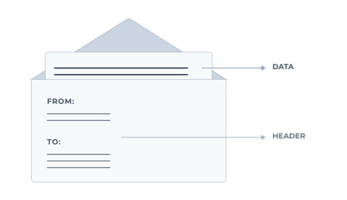
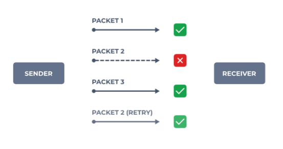
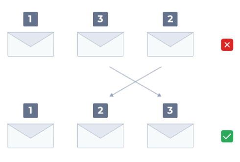
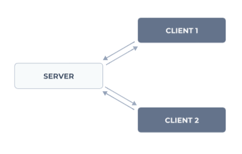
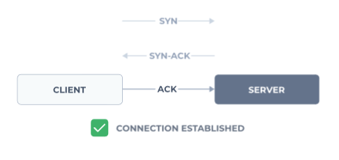

# TCP: An Overview

TCP is a widely used network protocol. It's a "reliable" protocol that runs on top of an unreliable protocol: IP, short for Internet Protocol.

## IP - The Internet's postal service
When a program sends data over the network using IP, the data is broken up and sent as multiple "packets".

Each packet contains:

- a header section
- a data section

The header contains a source and destination address, much like an envelope that you send through your local postal service.

The important similarity between IP and a postal service is that packets are **not guaranteed** to arrive at the destination. Although every effort is made to get it there, sometimes packets get lost in transit.

Furthermore, if you send 5 packets at once, there's no guarantee that they'll arrive at their destination at the same time or in the same order.

TCP was created to address these limitations of IP.

## TCP's Guarantees

Primarily, TCP offers two guarantees: 
**(a)** Reliable delivery of packets and **(b)** In-order delivery of packets.

#### Guarantee #1 - Reliable Delivery

TCP ensures that no packets are lost in transit. It does this by asking the receiver to acknowledge all sent packets, and re-transmitting any packets if an acknowledgement isn't received.

#### Guarantee #2 - Ordered Delivery
In addition to guaranteeing packets reach their destination, TCP also guarantees that the packets are delivered in order. It does this by labelling each packet with a sequence number. The receiver tracks these numbers and reorders out-of-sequence packets. If a packet is missing, the receiver waits for it to be re-transmitted.

## TCP Connections
TCP is a connection-oriented protocol, which means that to interact over TCP a program must first "establish a connection". To do this, one program takes the role of a "server", and the other program takes the role of a "client".

The server waits for connections, and the client initiates a connection. Once a connection is established, the client & server can both receive and send data (it's a two-way channel).

A TCP connection is identified using a unique combination of four values:

- destination IP address
- destination port number
- source IP address
- source port number

## TCP Handshake
The TCP handshake is how clients establish connections with servers. This is a 3-step process.

#### Step 1: SYN

First, the client initiates the connection by sending a SYN (synchronize) packet to the server, indicating a request to establish a connection. This packet also contains a sequence number to maintain the order of the packets being sent.

#### Step 2: SYN-ACK

The server, upon receiving this SYN packet, sends back a SYN-ACK (synchronize-acknowledge) packet.

#### Step 3: ACK
In the final step of this three-way handshake, the client acknowledges the server's SYN-ACK packet by sending an ACK (acknowledge) packet. The connection is considered established once this last packet is received by the server.

The three-way handshake ensures a reliable connection is created, verifies both devices are ready for data transmission, and sets initial sequence numbers for proper ordering of data packets.